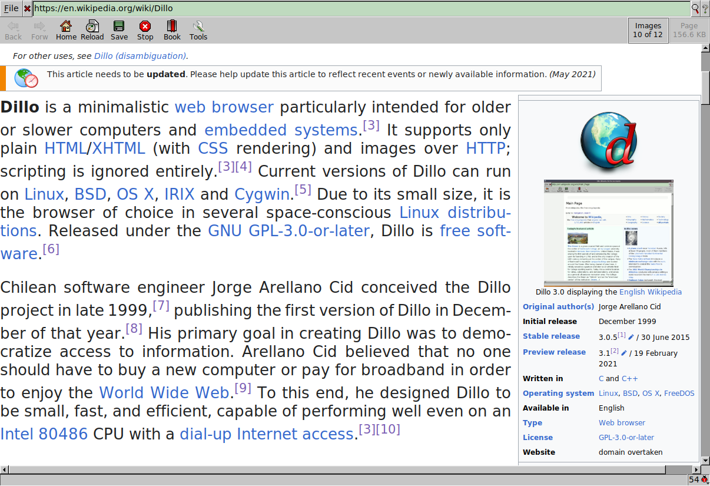

# Neodillo

<p align="center"></p>

Neodillo is a lightweight multi-platform graphical web browser based on Dillo, but **aims to make some valuable changes**, such as:

- [x] Option to play a video on an external Media Player (such as mpv)
- [ ] Better support for modern CSS
- [ ] Simple UI Adjustments
- [ ] Render supported files according to their type
- [ ] Customizable keybindings
- [ ] Search dialog
- [ ] New and clean codebase
- [ ] And more...

What Neodillo doesn't support (and won't):

- JavaScript
- Reading EPUB, PDF, or any other Document format

## Requirements

- FTLK 1.3

It's also **strongly recommended** that you install a TLS Library to browse HTTPS pages. Any of the following will do:

- OpenSSL 1.1 or 3
- LibreSSL
- mbedTLS 2 or 3

To build and install Neodillo follow the steps below.

## Building from source

First, clone this repository and nagivate into it. Then run the following commands: 

```sh
./autogen.sh
mkdir build
cd build
../configure --prefix=/usr/local --enable-tls --with-ca-certs-dir=/etc/ssl/certs
make
sudo make install
``` 

## Motivation

Modern browsers doesn't really care about performance, speed, security, extensibility or user experience. These browsers also became more than tools for accessing websites: they are also video players, pdf viewers, text editors, etc. That's exactly where Neodillo comes in. Neodillo is the perfect browser for you, if:

- You don't access any JavaScript-heavy webpages.
- You don't want your browser to be a PDF viewer.
- You want to use a browser that is actually lightweight and costumizable.
- You need a browser that runs on low-end PCs without any hassle.

## Gallery

<p align="center"></p>

